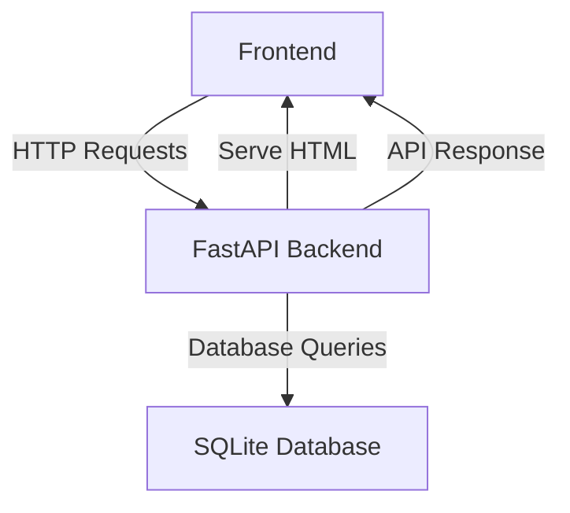

# Real-Time Crypto Portfolio Analyzer

## Overview
The Real-Time Crypto Portfolio Analyzer is a sophisticated web application designed to assist cryptocurrency investors and enthusiasts in managing their digital assets with ease and efficiency. This application provides a user-friendly interface for tracking and analyzing cryptocurrency portfolios in real-time. Users can manage their portfolios, view transaction history, and analyze performance metrics to make informed investment decisions. The application is particularly useful for individual investors and financial analysts seeking a streamlined method to monitor crypto assets and transactions.

The project utilizes FastAPI to construct a robust backend that serves dynamic content to the frontend. It employs a SQLite database to store user data, portfolio entries, transactions, and real-time cryptocurrency prices. The application is designed for easy deployment using Docker, ensuring a consistent environment across different systems.

## Features
- **User Management**: Securely manage user accounts with hashed passwords and unique email identification.
- **Portfolio Tracking**: Add, view, and manage cryptocurrency portfolio entries with real-time price updates.
- **Transaction History**: Record and view detailed transaction history, including buy and sell operations.
- **Real-Time Analytics**: Analyze portfolio performance over time with dynamic data visualization.
- **Responsive Design**: Access the application seamlessly across devices with a responsive UI.
- **Static and Dynamic Content**: Serve static files and dynamic HTML content efficiently.
- **Secure API Endpoints**: Interact with the application through secure RESTful API endpoints.

## Tech Stack
| Component       | Technology  |
|-----------------|-------------|
| Backend         | FastAPI     |
| Frontend        | HTML, CSS, JavaScript |
| Database        | SQLite      |
| Authentication  | Passlib (bcrypt) |
| Web Server      | Uvicorn     |
| Deployment      | Docker      |

## Architecture
The application follows a modular architecture where the backend serves both static and dynamic content to the frontend. The backend is built with FastAPI, which provides RESTful API endpoints for data interaction. The SQLite database models include `User`, `PortfolioEntry`, `Transaction`, and `CryptoPrice`, facilitating efficient data management.



## Getting Started

### Prerequisites
- Python 3.11+
- pip (Python package installer)
- Docker (optional, for containerized deployment)

### Installation
1. Clone the repository:
   ```bash
   git clone https://github.com/yourusername/real-time-crypto-portfolio-analyzer-auto.git
   cd real-time-crypto-portfolio-analyzer-auto
   ```
2. Install dependencies:
   ```bash
   pip install -r requirements.txt
   ```

### Running the Application
1. Start the FastAPI application:
   ```bash
   uvicorn app:app --reload
   ```
2. Open your web browser and visit:
   ```
   http://localhost:8000
   ```

## API Endpoints
| Method | Path               | Description                                  |
|--------|--------------------|----------------------------------------------|
| GET    | `/`                | Serve the dashboard HTML page                |
| GET    | `/portfolio`       | Serve the portfolio HTML page                |
| GET    | `/transactions`    | Serve the transactions HTML page             |
| GET    | `/analytics`       | Serve the analytics HTML page                |
| GET    | `/profile`         | Serve the profile HTML page                  |
| GET    | `/api/portfolios`  | Retrieve all portfolio entries               |
| POST   | `/api/portfolios`  | Add a new portfolio entry                    |
| GET    | `/api/transactions`| Retrieve all transactions                    |
| POST   | `/api/transactions`| Add a new transaction                        |
| GET    | `/api/user`        | Retrieve user information                    |

## Project Structure
```
real-time-crypto-portfolio-analyzer-auto/
├── app.py                  # Main application file with FastAPI setup
├── Dockerfile              # Docker configuration file
├── requirements.txt        # Python dependencies
├── start.sh                # Shell script for starting the application
├── static/
│   ├── css/
│   │   └── style.css       # Stylesheet for the application
│   └── js/
│       └── main.js         # JavaScript for client-side interactions
└── templates/
    ├── analytics.html      # HTML template for analytics page
    ├── dashboard.html      # HTML template for dashboard
    ├── portfolio.html      # HTML template for portfolio
    ├── profile.html        # HTML template for profile
    └── transactions.html   # HTML template for transactions
```

## Screenshots
*Screenshots of the application interface will be added here.*

## Docker Deployment
1. Build the Docker image:
   ```bash
   docker build -t crypto-portfolio-analyzer .
   ```
2. Run the Docker container:
   ```bash
   docker run -d -p 8000:8000 crypto-portfolio-analyzer
   ```

## Contributing
Contributions are welcome! Please fork the repository and submit a pull request for any feature additions or bug fixes. Ensure that your code adheres to the project's coding standards and includes appropriate tests.

## License
This project is licensed under the MIT License.

---
Built with Python and FastAPI.